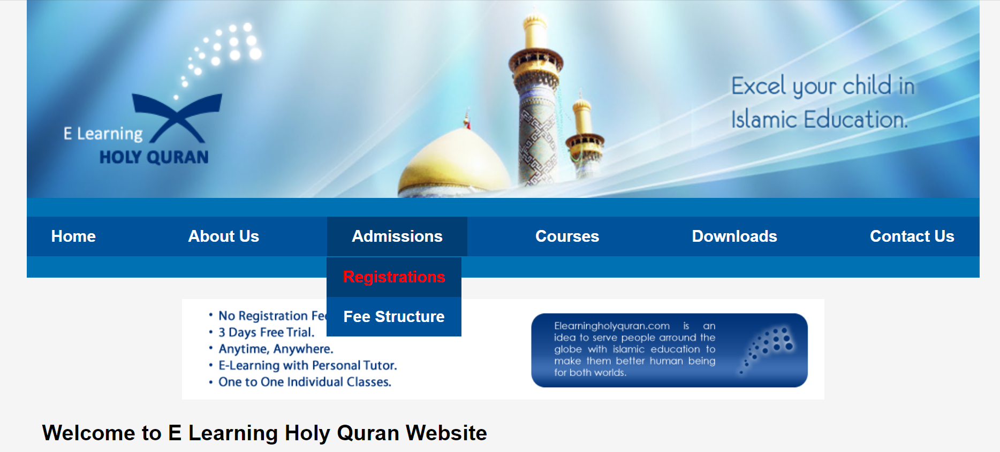

# ELearningHolyQuran

Welcome to the ELearningHolyQuran project repository! This project is a responsive and interactive platform designed to facilitate learning the Holy Quran online. Students from all around the world can access this platform to enroll and learn at their own pace.



## Introduction

ELearningHolyQuran is a comprehensive online platform that provides a user-friendly interface for students to study and memorize the Holy Quran. With its responsive design and interactive features, this platform aims to make Quranic education accessible to individuals of all ages and backgrounds, regardless of their geographical location.

## Features

- **Responsive Design:** The platform is optimized for various devices, including desktops, tablets, and mobile phones, ensuring a seamless learning experience across different screen sizes.
- **Interactive Learning Modules:** Engaging multimedia lessons, quizzes, and exercises help students grasp Quranic concepts effectively.
- **Progress Tracking:** Students can track their progress, view completed lessons, and monitor their performance to stay motivated and focused.
- **Admission Portal:** The admission portal allows new students to register and enroll in courses conveniently, streamlining the onboarding process.
- **Community Forums:** Integrated forums enable students to interact with instructors and peers, fostering a supportive learning environment.
- **Multilingual Support:** The platform supports multiple languages to accommodate a diverse global audience, promoting inclusivity and accessibility.

## Getting Started

To get started with ELearningHolyQuran, follow these steps:

1. Clone the repository:

   ```bash
   git clone https://github.com/iMamoonAkhter/ELearningHolyQuran.git
